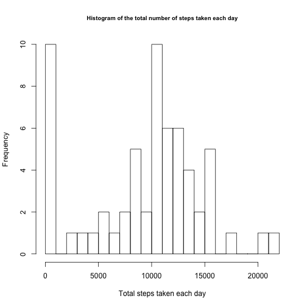
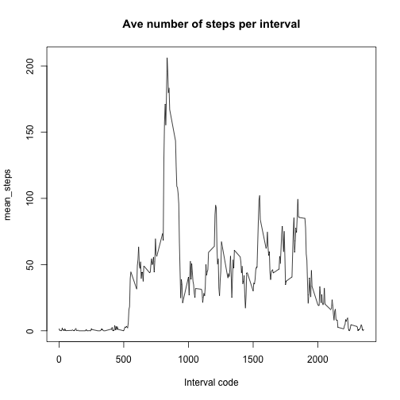
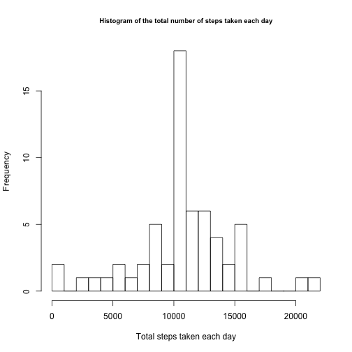
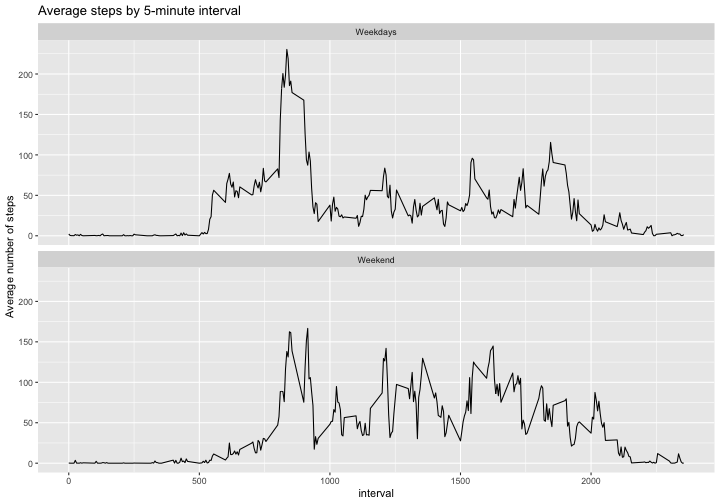

----
title: "Reproducible Research: Peer Assessment 1"
---

# Reproducible Research - Course Project 1

This assignment makes use of data from a personal activity monitoring device. This device collects data at 5 minute intervals through out the day. The data consists of two months of data from an anonymous individual collected during the months of October and November, 2012 and include the number of steps taken in 5 minute intervals each day.

## Loading and preprocessing the data
### Data download and load the data into a list called "activity"

```r
# Download zip file into the folder of "assignment1" if it doesn't exist
url<-"https://d396qusza40orc.cloudfront.net/repdata%2Fdata%2Factivity.zip"
download.file(url, destfile = "repdata_data_activity.zip", method="curl")
#unzip and save files in the "assignment1" folder
if(!file.exists("assignment1")) {
    unzip("repdata_data_activity.zip", exdir="./assignment1")
}
##read file, save it into a dataframe
activity <- read.csv("assignment1/activity.csv", header = TRUE)

#convert the date variable into Date
activity$date<-as.Date(as.character(activity$date), "%Y-%m-%d")
```

Load the dplyr and ggplot2 packagea:


```r
library(dplyr)
library(ggplot2)
```

## What is mean total number of steps taken per day?
First, I calculate the total number of steps taken per pay

```r
# Calculate the total number of steps taken per day
activity_day<-group_by(activity, date)
step_day<-summarize(activity_day,  Total=sum (steps,na.rm=TRUE))
```

```
## `summarise()` ungrouping output (override with `.groups` argument)
```
Make a histogram of the total number of steps taken each day

```r
# Make a histogram of the total number of steps taken each day
hist(step_day$Total, main = "Histogram of the total number of steps taken each day", xlab = "Total steps taken each day", breaks=20, cex.main=0.8)
```



The mean number of steps taken each day is:

```r
# Calculate and report the mean and median of the total number of steps taken per day
##Mean
mean(step_day$Total)
```

```
## [1] 9354.23
```
The median number of steps taken each day is:

```r
##median
median(step_day$Total)
```

```
## [1] 10395
```
        
## What is the average daily activity pattern?


```r
##Make a time series plot (i.e. type = "l") of the 5-minute interval (x-axis) and the average number of steps taken, averaged across all days (y-axis)
activity_interval<-group_by(activity, interval)
step_interval<-summarize(activity_interval,  mean_steps=mean (steps,na.rm=TRUE))
```

```
## `summarise()` ungrouping output (override with `.groups` argument)
```

```r
with(step_interval, plot(interval, mean_steps, type="l", main="Ave number of steps per interval", xlab="Interval code"))
```


\n The 5-minute interval that contains the maximum number of steps is:

```r
#Which 5-minute interval, on average across all the days in the dataset, contains the maximum number of steps?
step_interval [which.max (step_interval$mean_steps),][1]
```

```
## # A tibble: 1 x 1
##   interval
##      <int>
## 1      835
```

## Imputing missing values

Calculate and report the total number of missing values in the dataset (i.e. the total number of rows with NA)

```r
sum(is.na(activity$steps))
```

```
## [1] 2304
```

My strategy is to replace the NA with the mean of the corresponding 5-min interval.


```r
###Create a new dataset that is equal to the original dataset but with the missing data filled in.
new_activity<-activity
        for (i in 1:lengths(activity)) {
                if (is.na(new_activity[i,]$steps)) {
                        new_activity[i,]$steps<- subset(step_interval, interval==new_activity[i,]$interval)$mean_steps
                }
        }
```

```
## Warning in 1:lengths(activity): numerical expression has 3 elements: only the first used
```

```r
## Make a histogram of the total number of steps taken each day and Calculate and report the mean and median total number of steps taken per day. Do these values differ from the estimates from the first part of the assignment? What is the impact of imputing missing data on the estimates of the total daily number of steps?
step_day_new<-new_activity%>%group_by(date)%>%summarize(Total=sum(steps))
```

```
## `summarise()` ungrouping output (override with `.groups` argument)
```

```r
hist(step_day_new$Total, main = "Histogram of the total number of steps taken each day", xlab = "Total steps taken each day", breaks=20, cex.main=0.8)
```


Calculate and report the mean and median of the total number of steps taken per day after the missing values are place.
The mean of the total number of steps taken per day is:

```r
##mean
mean(step_day_new$Total)
```

```
## [1] 10766.19
```
The median of the total number of steps taken per day is:

```r
## median
median(step_day_new$Total)
```

```
## [1] 10766.19
```

After replacing the NAs with the mean number of steps for the corresponding interval, the mean 
and median number of steps became the same to each other. Replacing the NAs remove the extreme values in the dataset, so that the mean and median are close to each other.

## Are there differences in activity patterns between weekdays and weekends?


```r
##Use the dataset with the filled-in missing values for this part.
new_activity$weekdays<-weekdays(new_activity$date)
##Create a new factor variable in the dataset with two levels – “weekday” and “weekend” indicating whether a given date is a weekday or weekend day.

for (i in 1:lengths(new_activity)) {
        if (new_activity[i,]$weekdays=="Sunday" | new_activity[i,]$weekdays=="Saturday") {
                new_activity[i,]$weekdays<-"Weekend"
        }
        else {
                new_activity[i,]$weekdays<-"Weekdays"
        }
}
```

```
## Warning in 1:lengths(new_activity): numerical expression has 4 elements: only the first used
```

```r
#Make a panel plot containing a time series plot (i.e. type = "l") of the 5-minute interval (x-axis) and the average number of steps taken, averaged across all weekday days or weekend days (y-axis). 
new_activity_interval<-group_by(new_activity, weekdays, interval)
new_step_interval<-summarize(new_activity_interval,  mean_steps=mean (steps,na.rm=TRUE))
```

```
## `summarise()` regrouping output by 'weekdays' (override with `.groups` argument)
```

```r
P<-ggplot(new_step_interval,aes(x=interval, y=mean_steps))+geom_line()+facet_wrap(~weekdays, nrow=2) + ggtitle("Average steps by 5-minute interval")+ylab("Average number of steps")
P
```



Yes, there is a difference in activity patterns between weekdays and weekends.
The activity in weekends is evenly distributed, whereas the activity in weekdays focuses in earlier intervals of the day.

